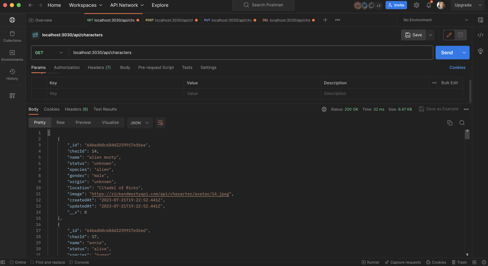
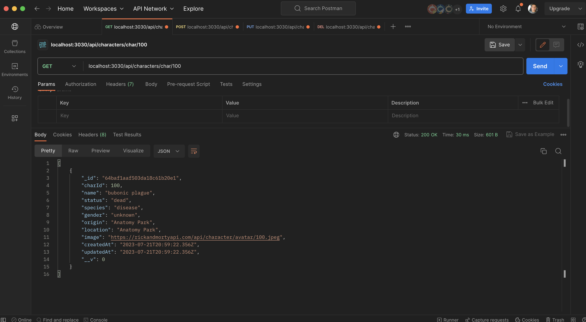
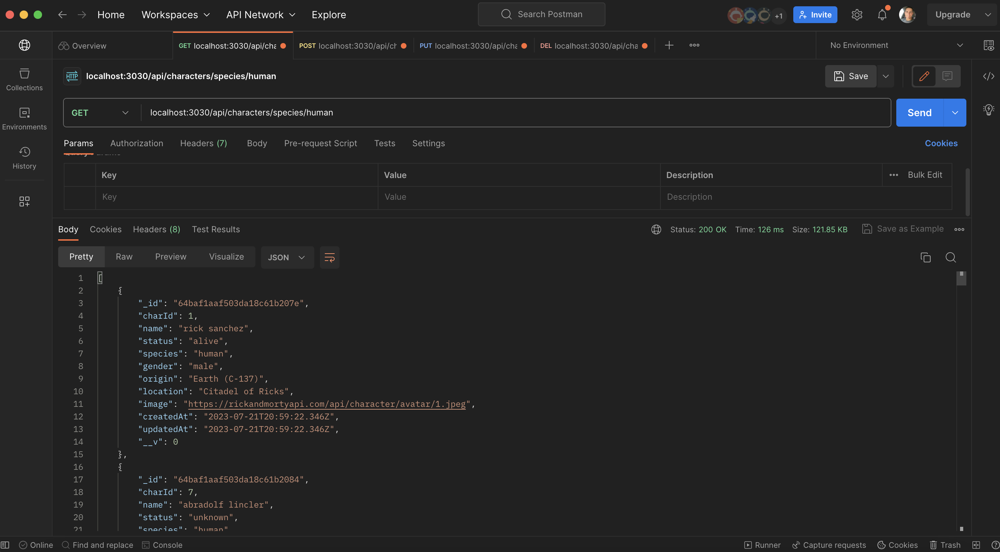
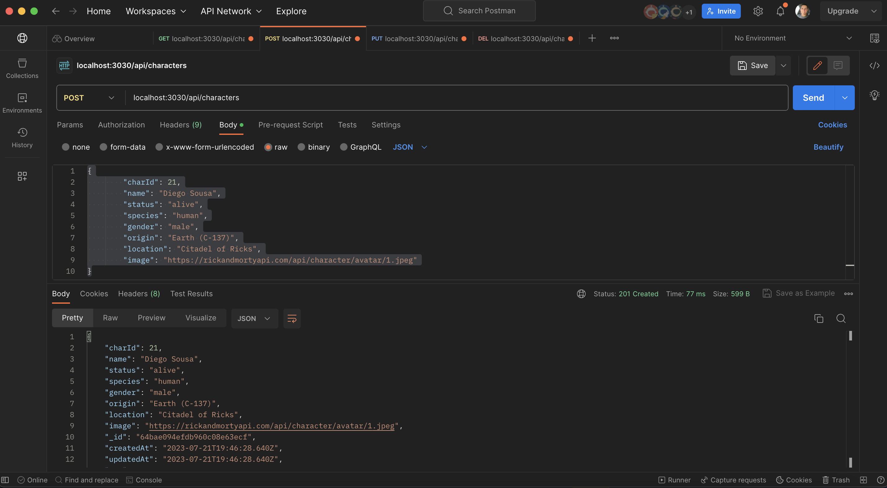
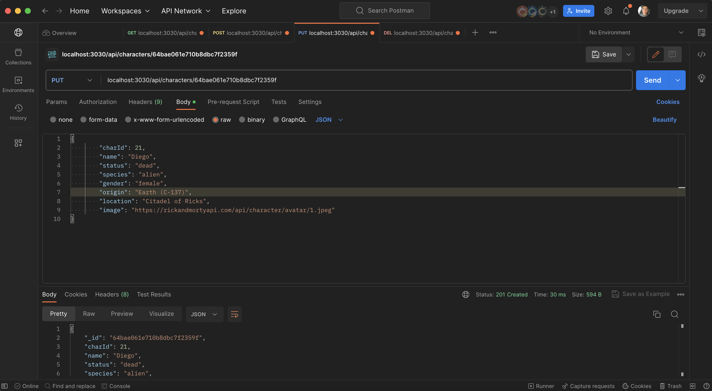
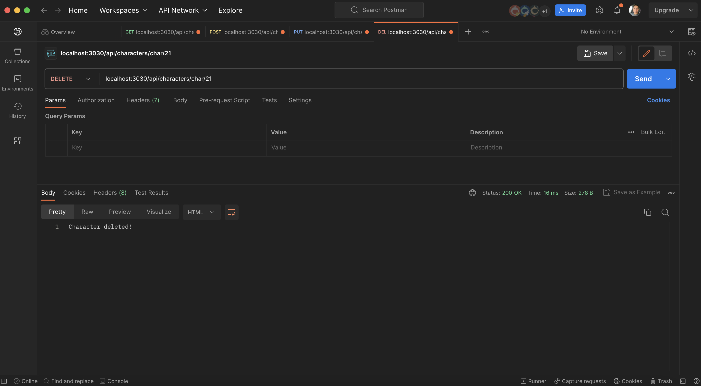

# My-Api Documentation

## Description

 The API is based on the Ricky and Morty API [Here is the original API](https://rickandmortyapi.com/api/character) and allows users to create, read, update and delete characters from the show. The API is fully documented [Here is My Api](https://my-apii-825654ca4ef9.herokuapp.com/api/characters).The API is built using Node.js, Express.js and MongoDB. The API is hosted on Heroku and the database is hosted on MongoDB Atlas.

## REST

The API is RESTful and uses the following HTTP methods:

- GET
- POST
- PUT
- DELETE

## Endpoints

### GET

- /api/characters - returns all characters
- /api/characters/char/:charId - returns a character by charId
- /api/characters/name/:name - returns a character by name
- /api/characters/species/:species - returns all character by species
-/api/characters/gender/:gender  - returns all characters by genders

### POST

- /api/characters - creates a new character

### PUT

- /api/characters/char/:charId - updates a character by charId

### DELETE

- /api/characters/char/:charId - deletes a character by charId

## Example

### GET

- [/api/characters](https://my-apii-825654ca4ef9.herokuapp.com/api/characters)
    
- [/api/characters/char/1](https://my-apii-825654ca4ef9.herokuapp.com/api/characters/char/1)
    
- [/api/characters/name/Rick Sanchez](https://my-apii-825654ca4ef9.herokuapp.com/api/characters/name/Rick%20Sanchez)
    
- [/api/characters/species/Human](https://my-apii-825654ca4ef9.herokuapp.com/api/characters/species/Human)
    

### POST

- [/api/characters](https://my-apii-825654ca4ef9.herokuapp.com/api/characters)
    

### PUT

- [/api/characters/char/1](https://my-apii-825654ca4ef9.herokuapp.com/api/characters/char/1)
    

### DELETE

- [/api/characters/char/1](https://my-apii-825654ca4ef9.herokuapp.com/api/characters/char/1)
    

## Character

There is a total of 826 characters sorted by id.

## Character schema

  | key | type | description |
  | --- | ---- | ----------- |
  | id | number | charId|
  | name | string | name of the |character |
  | status | string | status of the character |
  | species | string | species of the character |
  | gender | string | gender of the character |